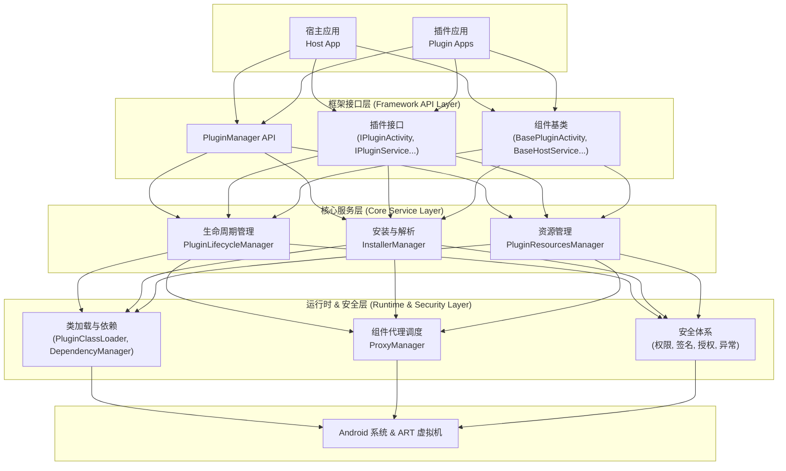

<p align="right"> 
   <b>简体中文</b> | <a href="README_EN.md">English</a> 
</p> 

<p align="center">
  
</p>

<p align="center">
  <strong>专为 Jetpack Compose 而生，100% 官方 API，0 Hook & 0 反射 的下一代 Android 插件化框架。</strong>
  <br />
  <em>现代、稳定、灵活，助您轻松构建“万物皆可插拔”的动态化应用。</em>
</p>

<p align="center">
  
  
  <a href="https://kotlinlang.org/"></a>
  <a href="https://developer.android.com/jetpack/compose"></a>
  <a href="https://developer.android.com/studio/releases/gradle-plugin"></a>
  <a href="https://gradle.org/"></a>
  <a href="https://github.com/lnzz123/ComboLite/blob/main/LICENSE"></a>
  <a href="https://github.com/lnzz123"></a>
</p>

---

<details>
<summary>📚 <b>目录 (Table of Contents)</b></summary>

- [🤔 为什么选择 ComboLite？](#-为什么选择-combolite)
- [✨ 核心特性](#-核心特性)
- [🚀 快速开始](#-快速开始-getting-started)
- [📚 文档列表](#-接下来做什么)
- [🆚 框架对比与技术选型](#-框架对比与技术选型)
- [🤝 如何贡献](#-如何贡献)
- [❤️ 支持与赞助](#-支持与赞助-support--sponsor)
- [许可](#许可-license)

</details>

---

### 🤔 为什么选择 ComboLite？

随着 Android 生态的演进，诞生于 View 时代的插件化框架已显得力不从心。它们或已停止维护，或严重依赖充满风险的
**非公开API (Hook与反射)**，在面临系统频繁更新时，兼容性问题频发，接入和维护成本极高。

**`ComboLite` 的诞生，正是为了终结这一困境。** 我们回归官方、拥抱简单，以完全公开的 API 为基石，实现了 *
*0 Hook、0 反射** 的纯净架构，从根本上保证了框架的极致稳定与长远兼容性。

|           示例插件页           |           示例插件页           |           示例插件页           |
|:-------------------------:|:-------------------------:|:-------------------------:|
|  |  |  |

|          安全校验机制           |          安全校验机制           |          异常处理机制           |
|:-------------------------:|:-------------------------:|:-------------------------:|
|  |  |  |


> 🔗 **下载示例App**: [https://github.com/lnzz123/ComboLite/tree/master/app/release/app-release.apk](https://raw.githubusercontent.com/lnzz123/ComboLite/refs/heads/master/app/release/app-release.apk)
>
> 
>
> **(说明：插件 APK 托管于 GitHub，若下载缓慢或失败，请尝试开启 VPN。)**


-----

### ✨ 核心特性

 `ComboLite` 的众多优势归纳为四大核心支柱，它们共同构成了框架的独特竞争力。

#### 🚀 极致开发体验 (Developer Experience)
* **源码级无缝调试**：通过配套 Gradle 插件，插件模块可在开发时自动集成进宿主，实现与原生模块完全一致的断点调试体验。彻底告别传统插件开发繁琐的“打包-安装-运行”循环，大幅提升开发迭代效率。
* **为 Compose 而生**：原生为 Jetpack Compose 设计，完美拥抱现代 Android UI 工具包。
* **拥抱现代技术栈**：深度集成 Kotlin Coroutines, Flow, Koin 等，让您在插件开发中也能享受最前沿的技术栈。

#### 🛡️ 企业级稳定性与安全 (Stability & Security)
* **绝对稳定的基石：0 Hook & 0 反射**：完全基于 Android 官方公开 API 构建，从根本上保证了框架的极致稳定与长远兼容性，让您彻底告别因系统升级导致的兼容性噩梦。
* **精细化权限管控**：通过 `@RequiresPermission` 注解实现对核心 API 的安全分级。高权限操作（如 `setPluginEnabled`）仅限**宿主签名的插件**调用 (`PermissionLevel.HOST`)；部分操作则限制为**插件对自身**的管理 (`PermissionLevel.SELF`)，为框架构建了坚实的安全防线。
* **灵活的校验策略**：提供 `Strict` (严格同签)、`UserGrant` (用户授权)、`Insecure` (不校验) 等多种签名校验策略，允许宿主根据业务场景，在安全性与开放性之间做出最合适的选择。
* **崩溃熔断与自愈**：内置强大的异常处理器，能自动隔离并禁用崩溃的插件，防止应用陷入无限重启。同时提供友好的错误提示 UI 和精细化的回调机制，最大限度保障宿主应用的健壮性。

#### 🏗️ 灵活的动态化架构 (Flexible Architecture)
* **去中心化设计**：打破传统“宿主-插件”的强中心化模式，任何插件都可拥有管理其他插件的能力。轻松实现“插件商店”、“按需下载”、“插件自更新”等高级动态化功能。
* **“空壳”宿主支持**：支持将宿主 App 极致轻量化，所有业务功能和 UI 均由插件动态提供，为模块化解耦和团队协作开发提供了终极方案。
* **智能依赖解析**：插件间的依赖关系无需预先配置，框架会在运行时自动发现并构建依赖图。热更新核心插件时，所有依赖它的上游插件均会自动链式重启，确保依赖的绝对一致性。

#### ⚡ 高性能核心 (High-Performance Core)
* **O(1) 类查找**：通过建立全局类索引，实现了 `O(1)` 时间复杂度的跨插件类查找，无论应用规模多庞大，类查找都能瞬间完成。
* **透明化资源管理**：所有插件的资源会被动态合并，开发者可以像访问宿主自身资源一样，透明地访问所有已加载插件的资源，无需关心其来源。
* **Service 实例池**：支持将同一个插件 `Service` 类启动为多个相互隔离的实例，为并行任务处理（如下载管理、多路视频流）等复杂场景提供了强大的支持。
-----

### 🏗️ 架构概览

`ComboLite` 采用简洁而强大的微核设计，通过分层架构实现高度的内聚和解耦，逻辑清晰，易于扩展。



-----

### 🚀 快速开始 (Getting Started)

`ComboLite` 已发布至 Maven Central，您可以像集成任何标准库一样轻松地将其引入项目。

#### 第 1 步: 定义项目依赖 (`libs.versions.toml`)

我们强烈建议使用 Version Catalog (`gradle/libs.versions.toml`) 来统一管理依赖。

```toml
# in gradle/libs.versions.toml

[versions]
# ...
combolite = "2.0.0"          # 建议使用最新稳定版
combolite-aar2apk = "1.1.0"   # 建议使用最新稳定版

[libraries]
# ...
combolite-core = { group = "io.github.lnzz123", name = "combolite-core", version.ref = "combolite" }

[plugins]
# ...
combolite-aar2apk = { id = "io.github.lnzz123.combolite-aar2apk", version.ref = "combolite-aar2apk" }
```

#### 第 2 步: 全局插件配置 (项目根 `build.gradle.kts`)

在项目**根目录**的 `build.gradle.kts` 中，应用插件并进行全局配置。

```kotlin
// in your project's root /build.gradle.kts
plugins {
    alias(libs.plugins.combolite.aar2apk)
}

// 在此声明所有插件模块，并配置打包策略与签名信息
aar2apk {
    modules {
        module(":sample-plugin:common")
        module(":sample-plugin:home")
        // ... 添加您所有的插件模块
    }

    signing {
        keystorePath.set(rootProject.file("your_keystore.jks").absolutePath)
        keystorePassword.set("your_password")
        keyAlias.set("your_alias")
        keyPassword.set("your_password")
    }
}
```

#### 第 3 步: 宿主 App 配置 (`:app/build.gradle.kts`)

在**宿主 App** 的 `build.gradle.kts` 中，添加核心库并配置开发时的自动集成。

```kotlin
// in your :app/build.gradle.kts
plugins {
    // ...
}

// 配置插件自动集成功能，用于源码无缝调试
packagePlugins {
    // 启用后，上述声明的插件将在构建时自动打包进宿主 assets
    enabled.set(true)
    buildType.set(PackageBuildType.DEBUG) // 或 RELEASE
    pluginsDir.set("debug_plugins")       // 插件在 assets 内的存放目录
}

dependencies {
    implementation(libs.combolite.core)
    // ...
}
```

#### 第 4 步: 插件模块配置 (e.g. `:sample-plugin:home`)

在您的**插件 Library** 模块中，使用 `compileOnly` 依赖核心库。

```kotlin
// in your :sample-plugin:home/build.gradle.kts
dependencies {
    // 插件模块必须使用 compileOnly，因为框架由宿主在运行时提供
    compileOnly(libs.combolite.core)
    // ...
}
```

**恭喜您，集成完毕！** 您的项目现在已经具备了 `ComboLite` 插件化框架的全部能力。

-----

### 📚 接下来做什么？

环境已经搭建完毕，现在我们强烈建议您阅读以下文档，开始您的插件化开发之旅：

* [**[必读] 快速开始**](docs/1_QUICK_START_ZH.md): 从零到一，构建并运行你的第一个插件。
* [**[核心] 插件打包指南**](docs/2_PACKAGING_GUIDE_ZH.md): 深入了解 `aar2apk` 插件，精通两种打包策略。
* [**[进阶] 核心 API 用法**](docs/3_CORE_APIS_ZH.md): 掌握 `PluginManager` 的所有核心功能。
* [**[进阶] 四大组件指南**](docs/4_COMPONENTS_GUIDE_ZH.md): 学习如何在插件中使用 Activity, Service,
  BroadcastReceiver, ContentProvider。
* [**[原理] 架构与设计**](docs/5_ARCHITECTURE_ZH.md): 探索 ComboLite 的内部工作机制。

-----

### 🆚 框架对比与技术选型

`ComboLite` 在设计之初，充分借鉴了前辈们的经验，并针对现代 Android 开发的痛点进行了革新。

| 对比维度                   | `ComboLite` (本项目)                            | `Shadow` (腾讯)                     | `RePlugin` (360)                     | 经典 Hook 方案 (VirtualAPK 等)    | Google Play Feature Delivery   |
|:-----------------------|:---------------------------------------------|:----------------------------------|:-------------------------------------|:-----------------------------|:-------------------------------|
| **核心原理**               | ✅ **官方公开 API + 代理模式**                        | 编译期代码重写 + 运行时委托                   | ClassLoader Hook + 部分系统Hook          | ❌ **重度 Hook 系统服务** (AMS/PMS) | ✅ **系统级原生支持**                  |
| **系统兼容性**              | 🥇 **极高**，无非公开 API 调用，天然适配 Android 7.0 - 16+ | 🥈 **较高**，绕开了大部分系统限制              | 🥉 **中等**，对 ClassLoader 的修改在新系统上存在风险 | 💥 **低**，对系统版本敏感，新系统上易失效     | 🥇 **极高**，官方方案                 |
| **Jetpack Compose 支持** | ✅ **原生支持**，核心设计目标                            | ❌ **不支持**                         | ❌ **不支持**                            | ❌ **不支持**                    | ✅ **原生支持**                     |
| **接入与使用成本**            | ✨ **极低**，微量核心代码，对项目几乎无侵入                     | ⚠️ **高**，依赖深度定制的 Gradle 插件，构建流程复杂 | ⚠️ **较高**，需理解其复杂的组件生命周期管理            | ⚠️ **较高**，需继承特定基类，配置繁琐       | ✨ **极低**，官方工具链原生支持             |
| **社区活跃度**              | 🚀 **活跃开发中**                                 | ⚠️ **维护放缓** (约2022年后)             | ❌ **基本停滞** (约2020年后)                 | ❌ **已停滞**                    | 🚀 **Google 官方持续迭代**           |
| **主要优势**               | **极致稳定、现代技术栈、开发体验好、去中心化架构**                  | 设计思想精巧，Activity 兼容性好              | 功能全面，曾有大规模验证                         | 特定版本下功能强大完备                  | 稳定可靠，Google Play 生态集成          |
| **主要权衡**               | 代理模式对部分冷门 `launchMode` 支持受限                  | 学习曲线陡峭，构建系统黑盒，已不兼容新版AGP           | 侵入性较强，兼容性问题随系统升级增多                   | **稳定性差，已不适用于现代开发**           | **非热更新，必须通过应用商店发布，无法加载本地 APK** |

-----

* **对比 Hook 方案 (如 VirtualAPK / DroidPlugin)**

    * **它们**: 通过 Hook 系统核心服务 (AMS/PMS) 来“欺骗”系统，功能强大但极其不稳定，随着系统版本迭代已基本失效，且均已停止维护。
    * **我们**: **绝不使用 Hook**。`ComboLite` 采用官方推荐的代理模式，虽然在某些极端 Activity
      启动模式上自由度稍逊，但换来的是坚如磐石的稳定性，这是我们最重要的承诺。

* **对比编译期方案 (如 Shadow)**

    * **它们**: 设计精巧，通过编译期重写代码绕开 Hook，稳定性更高。但其构建系统复杂，学习曲线陡峭，且项目已放缓维护，对新技术栈（如
      Compose）支持滞后。
    * **我们**: **拥抱简单与现代**。`ComboLite` 保持核心逻辑的清晰透明，与最新的 AGP/Gradle/Compose
      工具链完美同步，让开发者能将精力聚焦于业务本身，而非复杂的框架底层。

* **对比 RePlugin (360)**

    * **它们**: 同样是业界经典，通过 Hook ClassLoader 实现功能，但在新版 Android 对非公开 API
      限制愈发严格的今天，其稳定性面临挑战。项目也已基本停止维护，对 Compose 等新技术栈缺乏支持。
    * **我们**: **选择面向未来的稳定路线**。`ComboLite` 彻底规避了 Hook 带来的兼容性风险，并原生为
      Jetpack Compose 设计，确保在现代技术栈下获得最佳的开发体验和长期维护性。

* **对比 Google Play Feature Delivery**

    * **它们**: 是一个**应用分发方案**，旨在减少初始安装包体积，所有模块更新仍需通过应用商店审核和下发，本质上是“冷分发”，无法实现真正的热更新。
    * **我们**: **是一个纯粹的热更新框架**。`ComboLite` 赋予 App 在运行时加载任意来源 APK
      的能力，可以完全绕开应用商店进行功能迭代和 Bug 修复，这才是动态化的核心价值。

插件化技术没有绝对完美方案，选择即是取舍。`ComboLite` 的设计哲学是在保证 **99%**
主流场景的极致稳定与简洁性的前提下，审慎对待那 **1%** 的边缘场景。

> **总而言之，如果您正在开发一个面向未来的、使用 Jetpack
> Compose、且将长期稳定性和可维护性放在首位的项目，`ComboLite` 将是您的不二之- 选。**

-----

### 🤝 如何贡献

我们热切欢迎任何形式的贡献！无论是提交功能建议、报告 Bug、还是发起 Pull Request，都是对社区的巨大帮助。

* **报告 Bug 或提交建议**: 请通过 [GitHub Issues](https://github.com/lnzz123/ComboLite/issues) 提交。
* **贡献代码**: Fork 本仓库，完成修改后向上游发起 Pull Request。

-----

### ❤️ 支持与赞助 (Support & Sponsor)

`ComboLite` 是一个免费的开源项目，由我利用业余时间进行开发和维护。如果这个项目对您有帮助，您的支持将是我持续投入的莫大动力。

<details>
  <summary>点击查看赞助方式 (Click to see sponsorship methods)</summary>

  <br>

  <p>您的每一份支持都意义非凡。可以通过以下方式请我喝杯咖啡 ☕️：</p>

  <table>
    <tr>
      <td align="center">支付宝 (Alipay)</td>
      <td align="center">微信支付 (WeChat Pay)</td>
    </tr>
    <tr>
      <td align="center"></td>
      <td align="center"></td>
    </tr>
  </table>
</details>

-----

### 许可 (License)

`ComboLite` 遵循 [Apache-2.0 license](https://github.com/lnzz123/ComboLite/blob/main/LICENSE)
开源许可协议。

## Star History

[](https://www.star-history.com/#lnzz123/ComboLite&Date)