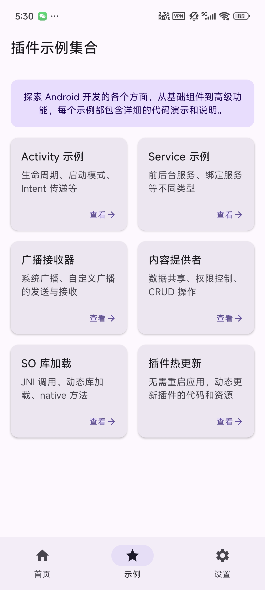
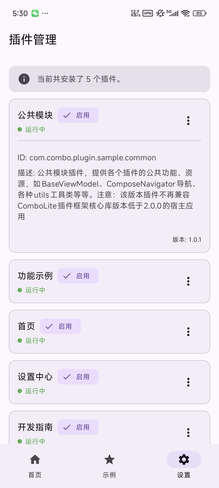
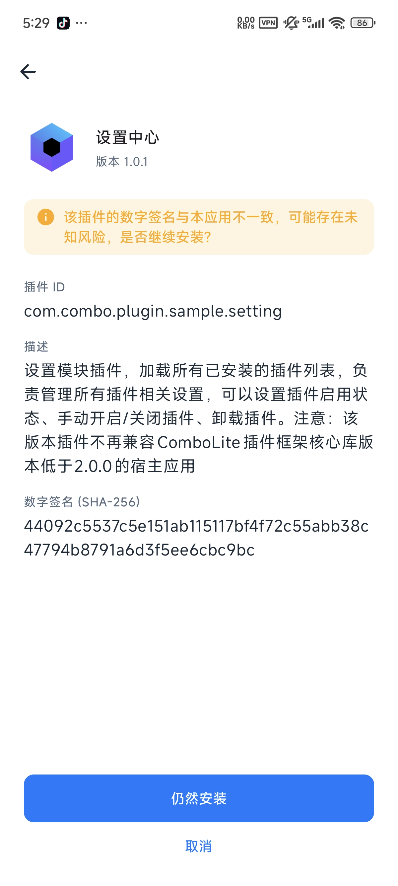
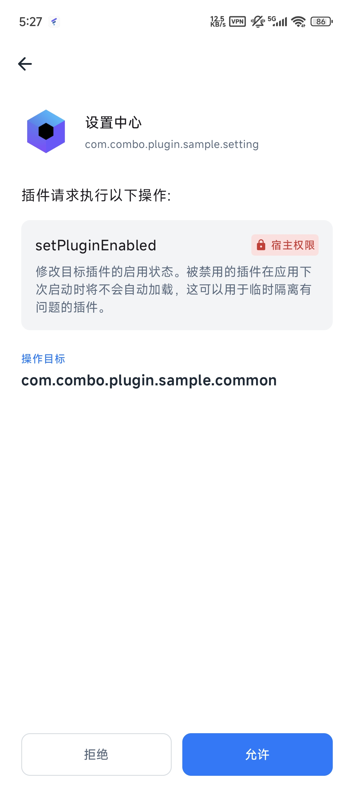
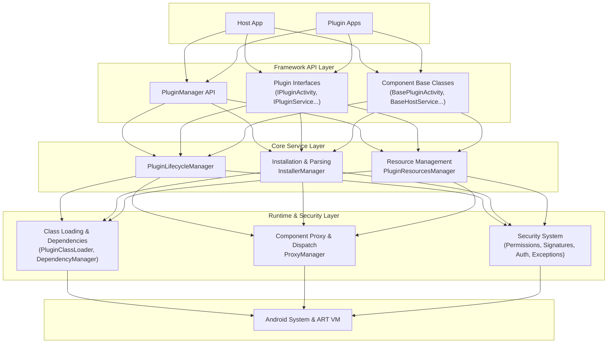

<p align="right">
<a href="README.md">简体中文</a> | <b>English</b>
</p>

<p align="center">
  
</p>

<p align="center">
<strong>The next-generation Android plugin framework, born for Jetpack Compose, using 100% official APIs with 0 Hooks & 0 Reflection.</strong>
<br />
<em>Modern, stable, and flexible, helping you easily build dynamic applications where "everything is pluggable."</em>
</p>

<p align="center">


<a href="https://kotlinlang.org/"></a>
<a href="https://developer.android.com/jetpack/compose"></a>
<a href="https://developer.android.com/studio/releases/gradle-plugin"></a>
<a href="https://gradle.org/"></a>
<a href="https://github.com/lnzz123/ComboLite/blob/main/LICENSE"></a>
<a href="https://github.com/lnzz123"></a>
</p>

-----

<details>
<summary>📚 <b>Table of Contents</b></summary>

- [🤔 Why Choose ComboLite?](#-why-choose-combolite)
- [✨ Core Features](#-core-features)
- [🚀 Getting Started](#-getting-started)
- [📚 Documentation List](#-whats-next)
- [🆚 Framework Comparison & Technology Selection](#-framework-comparison--technical-selection)
- [🤝 How to Contribute](#-how-to-contribute)
- [❤️ Support & Sponsor](#-support--sponsor)
- [License](#license)

</details>

-----

### 🤔 Why Choose ComboLite?

As the Android ecosystem evolves, plugin frameworks born in the View era are struggling to keep up. They are either no longer maintained or rely heavily on risky **non-public APIs (Hooks and reflection)**. Faced with frequent system updates, they suffer from recurring compatibility issues, making integration and maintenance costs extremely high.

**`ComboLite` was born to end this predicament.** We return to official standards and embrace simplicity. Built on a foundation of entirely public APIs, we have achieved a pure architecture with **0 Hooks and 0 Reflection**, fundamentally guaranteeing the framework's ultimate stability and long-term compatibility.

|    Sample Plugin Page     |    Sample Plugin Page     |    Sample Plugin Page     |
|:-------------------------:|:-------------------------:|:-------------------------:|
|  |  |  |

| Security Verification Mechanism | Security Verification Mechanism | Exception Handling Mechanism |
|:-------------------------------:|:-------------------------------:|:----------------------------:|
|        |        |     |

> 🔗 **Download Sample App**: [https://github.com/lnzz123/ComboLite/tree/master/app/release/app-release.apk](https://raw.githubusercontent.com/lnzz123/ComboLite/refs/heads/master/app/release/app-release.apk)
>
> **(Note: Plugin APKs are hosted on GitHub. If the download is slow or fails, please try using a VPN.)**

-----

### ✨ Core Features

`ComboLite`'s numerous advantages are summarized into four core pillars, which together form its unique competitive edge.

#### 🚀 Ultimate Developer Experience

* **Seamless Source-Level Debugging**: With the companion Gradle plugin, plugin modules are automatically integrated into the host during development, providing a breakpoint debugging experience identical to native modules. This completely eliminates the tedious "build-install-run" cycle of traditional plugin development, significantly boosting iteration efficiency.
* **Born for Compose**: Natively designed for Jetpack Compose, perfectly embracing the modern Android UI toolkit.
* **Embraces Modern Tech Stacks**: Deeply integrated with Kotlin Coroutines, Flow, Koin, and more, allowing you to enjoy the cutting-edge technology stack in your plugin development.

#### 🛡️ Enterprise-Grade Stability & Security

* **The Bedrock of Stability: 0 Hooks & 0 Reflection**: Built entirely on Android's official public APIs, this fundamentally guarantees the framework's ultimate stability and long-term compatibility, freeing you from the nightmare of compatibility issues caused by system upgrades.
* **Fine-Grained Permission Control**: Implements security levels for core APIs via the `@RequiresPermission` annotation. High-privilege operations (like `setPluginEnabled`) are restricted to **plugins signed by the host** (`PermissionLevel.HOST`), while some operations are limited to **a plugin managing itself** (`PermissionLevel.SELF`), building a solid security defense for the framework.
* **Flexible Verification Strategies**: Offers multiple signature verification strategies such as `Strict` (identical signature), `UserGrant` (user authorization), and `Insecure` (no verification), allowing the host to strike the right balance between security and openness based on business scenarios.
* **Crash Fusing and Self-Healing**: A powerful built-in exception handler automatically isolates and disables crashing plugins to prevent the app from falling into an infinite restart loop. It also provides user-friendly error UI and fine-grained callback mechanisms to maximize the robustness of the host application.

#### 🏗️ Flexible & Dynamic Architecture

* **Decentralized Design**: Breaks the traditional "host-plugin" centralized model. Any plugin can have the ability to manage other plugins, making it easy to implement advanced dynamic features like a "plugin store," "on-demand downloads," and "plugin self-updates."
* **"Shell" Host Support**: Supports making the host app extremely lightweight, with all business logic and UI provided dynamically by plugins. This offers the ultimate solution for modular decoupling and collaborative team development.
* **Intelligent Dependency Resolution**: Dependencies between plugins do not need to be pre-configured; the framework automatically discovers and builds the dependency graph at runtime. When a core plugin is hot-updated, all upstream plugins that depend on it will automatically restart in a chain, ensuring absolute dependency consistency.

#### ⚡ High-Performance Core

* **O(1) Class Lookup**: By establishing a global class index, it achieves `O(1)` time complexity for cross-plugin class lookups. No matter how large the application scale, class lookups are completed instantly.
* **Transparent Resource Management**: Resources from all plugins are dynamically merged. Developers can access resources from all loaded plugins transparently, just like accessing the host's own resources, without needing to care about their origin.
* **Service Instance Pool**: Supports launching the same plugin `Service` class into multiple isolated instances, providing powerful support for complex scenarios involving parallel task processing (such as download management, multi-channel video streaming, etc.).

-----

### 🏗️ Architecture Overview

`ComboLite` employs a concise and powerful micro-kernel design. It achieves high cohesion and decoupling through a layered architecture, resulting in clear logic that is easy to extend.



-----

### 🚀 Getting Started

`ComboLite` is published to Maven Central. You can easily add it to your project just like any other standard library.

#### Step 1: Define Project Dependencies (`libs.versions.toml`)

We strongly recommend using Version Catalog (`gradle/libs.versions.toml`) to manage dependencies uniformly.

```toml
# in gradle/libs.versions.toml

[versions]
# ...
combolite = "2.0.0"          # Recommended to use the latest stable version
combolite-aar2apk = "1.1.0"   # Recommended to use the latest stable version

[libraries]
# ...
combolite-core = { group = "io.github.lnzz123", name = "combolite-core", version.ref = "combolite" }

[plugins]
# ...
combolite-aar2apk = { id = "io.github.lnzz123.combolite-aar2apk", version.ref = "combolite-aar2apk" }
```

#### Step 2: Global Plugin Configuration (Project Root `build.gradle.kts`)

In your project's **root** `build.gradle.kts`, apply the plugin and set up global configurations.

```kotlin
// in your project's root /build.gradle.kts
plugins {
    alias(libs.plugins.combolite.aar2apk)
}

// Declare all your plugin modules here, and configure packaging policies and signing information
aar2apk {
    modules {
        module(":sample-plugin:common")
        module(":sample-plugin:home")
        // ... Add all your plugin modules
    }

    signing {
        keystorePath.set(rootProject.file("your_keystore.jks").absolutePath)
        keystorePassword.set("your_password")
        keyAlias.set("your_alias")
        keyPassword.set("your_password")
    }
}
```

#### Step 3: Host App Configuration (`:app/build.gradle.kts`)

In your **host app's** `build.gradle.kts`, add the core library and configure automatic integration for development.

```kotlin
// in your :app/build.gradle.kts
plugins {
    // ...
}

// Configure the plugin auto-integration feature for seamless source-level debugging
packagePlugins {
    // When enabled, the plugins declared above will be automatically packaged into the host's assets during build
    enabled.set(true)
    buildType.set(PackageBuildType.DEBUG) // or RELEASE
    pluginsDir.set("debug_plugins")       // The directory where plugins are stored within assets
}

dependencies {
    implementation(libs.combolite.core)
    // ...
}
```

#### Step 4: Plugin Module Configuration (e.g., `:sample-plugin:home`)

In your **plugin library** module, use `compileOnly` to depend on the core library.

```kotlin
// in your :sample-plugin:home/build.gradle.kts
dependencies {
    // Plugin modules must use compileOnly because the framework is provided by the host at runtime
    compileOnly(libs.combolite.core)
    // ...
}
```

**Congratulations, the integration is complete!** Your project now has the full capabilities of the `ComboLite` plugin framework.

-----

### 📚 What's Next?

With the environment set up, we strongly recommend you read the following documents to begin your plugin development journey:

* **[[Must Read] Quick Start](./docs/1_QUICK_START_EN.md)**: Build and
  run your first plugin from scratch.
* **[[Core] Packaging Guide](./docs/2_PACKAGING_GUIDE_EN.md)**: Dive
  deep into the `aar2apk` plugin and master both packaging strategies.
* **[[Advanced] Core API Usage](./docs/3_CORE_APIS_EN.md)**: Master all
  the core functions of `PluginManager`.
* **[[Advanced] Four Components Guide](./docs/4_COMPONENTS_GUIDE_EN.md)**: Learn how to use Activity, Service, BroadcastReceiver, and ContentProvider within plugins.
* **[[Principles] Architecture & Design](./docs/5_ARCHITECTURE_EN.md)**: Explore the internal workings of ComboLite.

-----

### 🆚 Framework Comparison & Technical Selection

During its initial design, `ComboLite` drew heavily from the experiences of its predecessors and innovated to address the pain points of modern Android development.

| Comparison Aspect           | `ComboLite` (This Project)                                                 | `Shadow` (Tencent)                                                               | `RePlugin` (360)                                                | Classic Hook-based (VirtualAPK, etc.)                            | Google Play Feature Delivery                                               |
|:----------------------------|:---------------------------------------------------------------------------|:---------------------------------------------------------------------------------|:----------------------------------------------------------------|:-----------------------------------------------------------------|:---------------------------------------------------------------------------|
| **Core Principle**          | ✅ **Official Public APIs + Proxy Pattern**                                 | Compile-time code rewriting + Runtime delegate                                   | ClassLoader Hook + Partial system hooks                         | ❌ **Heavy Hooking of System Services (AMS/PMS)**                 | ✅ **Native System-level Support**                                          |
| **System Compatibility**    | 🥇 **Excellent**, no non-public API calls                                  | 🥈 **High**, bypasses most system limits                                         | 🥉 **Medium**, ClassLoader modification is risky on new systems | 💥 **Low**, sensitive to system versions, easily fails on new OS | 🥇 **Excellent**, official solution                                        |
| **Jetpack Compose Support** | ✅ **Native Support**, a core design goal                                   | ❌ **Not Supported**                                                              | ❌ **Not Supported**                                             | ❌ **Not Supported**                                              | ✅ **Native Support**                                                       |
| **Integration Cost**        | ✨ **Very Low**, minimal core code, non-invasive                            | ⚠️ **High**, relies on a custom Gradle plugin                                    | ⚠️ **High**, complex component lifecycle management             | ⚠️ **High**, requires inheriting specific base classes           | ✨ **Very Low**, natively supported                                         |
| **Community Activity**      | 🚀 **Actively Developed**                                                  | ⚠️ **Slowed Maintenance** (since ~2022)                                          | ❌ **Mostly Stagnant** (since ~2020)                             | ❌ **Stagnant**                                                   | 🚀 **Actively Developed by Google**                                        |
| **Key Advantages**          | **Ultimate stability, modern stack, great DX, decentralized architecture** | Ingenious design, good Activity compatibility                                    | Comprehensive features, previously validated at scale           | Powerful features on specific OS versions                        | Reliable, integrated with Google Play                                      |
| **Key Trade-offs**          | Proxy pattern has limited support for some rare `launchMode`s              | Steep learning curve, black-box build system, incompatible with new AGP versions | Invasive, compatibility issues increase with OS upgrades        | **Poor stability, unsuitable for modern development**            | **Not hot-update, must be released via app store, cannot load local APKs** |

-----

* **Versus Hook-based solutions (e.g., VirtualAPK / DroidPlugin)**

    * **Them**: They "trick" the system by hooking core services (AMS/PMS). While powerful, they are extremely unstable and have become largely obsolete with system iterations. All are no longer maintained.
    * **Us**: **We never use Hooks.** `ComboLite` uses the officially recommended proxy pattern. Although it offers slightly less freedom with some extreme Activity launch modes, it provides rock-solid stability in return, which is our most important commitment.

* **Versus Compile-time solutions (e.g., Shadow)**

    * **Them**: Ingeniously designed, they avoid hooks by rewriting code at compile time, offering higher stability. However, their build system is complex, the learning curve is steep, and the project's maintenance has slowed, lagging in support for new tech stacks (like Compose).
    * **Us**: **We embrace simplicity and modernity.** `ComboLite` keeps its core logic clear and transparent, and it is perfectly synchronized with the latest AGP/Gradle/Compose toolchains. This allows developers to focus on business logic rather than complex framework internals.

* **Versus RePlugin (360)**

    * **Them**: Another industry classic that works by hooking the ClassLoader. However, as modern Android becomes increasingly restrictive of non-public APIs, its stability is challenged. The project is also largely unmaintained and lacks support for new technologies like Compose.
    * **Us**: **We choose a future-proof, stable path.** `ComboLite` completely avoids the compatibility risks brought by hooks and is natively designed for Jetpack Compose, ensuring the best development experience and long-term maintainability on modern tech stacks.

* **Versus Google Play Feature Delivery**

    * **Them**: This is an **app delivery solution** aimed at reducing initial install size. All module updates must still be reviewed and distributed through the app store. It is essentially "cold delivery" and cannot achieve true hot-updates.
    * **Us**: **We are a pure hot-update framework.** `ComboLite` gives an app the ability to load APKs from any source at runtime, completely bypassing the app store for feature iterations and bug fixes. This is the core value of dynamization.

There is no perfect solution in plugin technology; every choice is a trade-off. `ComboLite`'s design philosophy is to ensure the ultimate stability and simplicity for **99%** of mainstream scenarios while cautiously handling the **1%** of edge cases.

> **In summary, if you are developing a forward-looking project that uses Jetpack Compose and prioritizes long-term stability and maintainability, `ComboLite` is your definitive choice.**

-----

### 🤝 How to Contribute

We eagerly welcome contributions of any kind! Whether it's submitting feature suggestions, reporting
bugs, or creating a Pull Request, every bit of help is a huge benefit to the community.

* **Report Bugs or Suggest Features**: Please submit them
  via [GitHub Issues](https://github.com/lnzz123/ComboLite/issues).
* **Contribute Code**: Fork this repository, make your changes, and then open a Pull Request to the
  upstream.

-----

### ❤️ Support & Sponsor

`ComboLite` is a free, open-source project developed and maintained in my spare time. If this
project is helpful to you, your support will be the greatest motivation for my continued dedication.

<details>
<summary>Click to see sponsorship methods</summary>

<br>

<p>Every bit of your support is meaningful. You can buy me a cup of coffee ☕️ through the following methods:</p>

<table>
<tr>
<td align="center">Alipay</td>
<td align="center">WeChat Pay</td>
</tr>
<tr>
<td align="center"></td>
<td align="center"></td>
</tr>
</table>
</details>

-----

### License

`ComboLite` is licensed under
the [Apache-2.0 license](https://github.com/lnzz123/ComboLite/blob/main/LICENSE).

## Star History

[](https://www.star-history.com/#lnzz123/ComboLite&Date)
