# Quick Start: Run Your First Plugin from Scratch

Welcome to your journey with `ComboLite`\! This guide will act as your patient companion, leading you to build and launch your first dynamic plugin in the time it takes to drink a cup of coffee.

We will walk you through the entire process of **host configuration**, **plugin creation**, and **plugin execution**. This will allow you to quickly experience the satisfaction of "lighting up" your first plugin without getting bogged down in complex packaging details. Ready? Let's get started\!

### Prerequisites

Before we begin, we assume that you have already successfully integrated the `ComboLite` core library and packaging plugin into your Android project, as instructed in the main `README`.

### Overall Process Preview

```mermaid
graph LR
    subgraph "Development Environment Setup"
        A[🏠 Configure Host & Plugin Modules] --> B[⚙️ Declare Plugins in Root build.gradle];
        B --> C[🔧 Enable Auto-Integration in Host build.gradle];
    end

    subgraph "Build Stage (Handled Automatically by Gradle)"
        D{Build Host App};
        D -- Auto-triggers --> E[1. Compile Plugin Modules];
        E -- Generates APK --> F[2. Package Plugin APKs into Host Assets];
    end

    subgraph "Runtime Stage"
        G[🚀 Write Loading & Interaction Code] --> H[🎉 Run and Witness the Magic];
    end

    C --> D;
    F --> G;
```



-----

## Step 1: Configure the Host App

The host is the "home" for all plugins. We need to perform some basic initialization and configuration for it.

### 1.1 Initialize the Plugin Framework

`ComboLite` offers flexible initialization options. We provide two methods:

#### Method 1: Automatic Initialization (Recommended)

This is the most hassle-free approach. Simply have your `Application` class inherit from `BaseHostApplication`, and the framework will handle the underlying initialization process for you. You only need to override the `onFrameworkSetup` method to perform all core framework configurations within a background coroutine.

```kotlin
// in :app/src/main/java/your/package/name/MainApplication.kt
import com.combo.core.runtime.PluginManager
import com.combo.core.runtime.ValidationStrategy
import com.combo.core.runtime.app.BaseHostApplication
import com.combo.core.security.crash.PluginCrashHandler

class MainApplication : BaseHostApplication() {
    override fun onCreate() {
        super.onCreate()
        // Your other application-level initialization logic
    }

    /**
     * Override this method to provide custom plugin framework setup logic on a background thread.
     * PluginManager.initialize is called automatically within super.onCreate(), and this block will be executed.
     */
    override fun onFrameworkSetup(): suspend () -> Unit {
        return {
            // --- Perform all framework-related configurations here ---

            // Example 1: Configure proxy pools for the four major components
            PluginManager.proxyManager.apply {
                setHostActivity(HostActivity::class.java)
                setServicePool(listOf(HostService1::class.java /*, ... */))
                setHostProviderAuthority("com.your.package.provider")
            }

            // Example 2: Set the plugin signature validation strategy (here, set to Insecure for development only)
            PluginManager.setValidationStrategy(ValidationStrategy.Insecure)
            
            // Note: The timing of plugin loading should be determined by your business logic, 
            // for example, triggered on the main page or at a specific moment.
        }
    }
}
```

#### Method 2: Manual Initialization (For Special Scenarios)

If your `Application` class cannot inherit from `BaseHostApplication` due to project constraints, you can opt for manual initialization.

```kotlin
// in :app/src/main/java/your/package/name/MainApplication.kt
import android.app.Application
import com.combo.core.runtime.PluginManager
import com.combo.core.runtime.ValidationStrategy
import com.combo.core.security.crash.PluginCrashHandler

class MainApplication : Application() {
    override fun onCreate() {
        super.onCreate()

        // 1. (Important) Register the plugin crash handler
        PluginCrashHandler.initialize(this)

        // 2. Initialize the PluginManager and complete the configuration in its background task
        PluginManager.initialize(this) {
            // This code block executes on a background thread
            PluginManager.setValidationStrategy(ValidationStrategy.Insecure)
            // ... other configurations
        }
    }
}
```

### 1.2 Configure the Host Activity

To ensure that plugins can correctly access resources and be started via proxy, your host `Activity` needs to inherit from `BaseHostActivity`.

```kotlin
import com.combo.core.component.activity.BaseHostActivity

class MainActivity : BaseHostActivity() {
    // ...
}
```

> **Important Note**: `BaseHostActivity` internally overrides the `getResources()` and `getAssets()` methods to ensure plugins can seamlessly access both the host's and their own resources. It also contains the core logic required to proxy plugin `Activity` components.

-----

## Step 2: Create Your First Plugin

### 2.1 Create a New Plugin Module and Add Dependencies

In your project, create a new Android **Library** module (e.g., named `:my-plugin`). In the new module's `build.gradle.kts` file, add a **compile-time dependency** on `comboLite-core`:

```kotlin
// in :my-plugin/build.gradle.kts
dependencies {
    // Plugin modules must use compileOnly because the framework is provided by the host at runtime
    compileOnly(projects.comboLiteCore) 
    // ... other dependencies
}
```

### 2.2 Implement the Plugin Entry Class (IPluginEntryClass)

Each plugin needs an entry class that implements the `IPluginEntryClass` interface. This class acts as the bridge between the plugin and the framework, containing the plugin's lifecycle, UI entry point, and dependency injection configuration.

```kotlin
// in :my-plugin/src/main/java/com/example/myplugin/MyPluginEntry.kt
package com.example.myplugin

import androidx.compose.material3.Text
import androidx.compose.runtime.Composable
import com.combo.core.api.IPluginEntryClass
import com.combo.core.model.PluginContext
import org.koin.core.module.Module
import org.koin.dsl.module

class MyPluginEntry : IPluginEntryClass {

    /**
     * 1. (Optional) Declare the Koin dependency injection modules provided by this plugin.
     * Internal dependencies of the plugin can be defined here, and the framework will automatically integrate and unload them.
     */
    override val pluginModule: List<Module>
        get() = listOf(
            module {
                // Example: single<MyPluginRepository> { MyPluginRepositoryImpl() }
            }
        )
    
    /**
     * 2. Implement the onLoad lifecycle callback.
     * This method is called after the plugin is loaded by the framework.
     * It is the best place to perform all initialization logic.
     */
    override fun onLoad(context: PluginContext) {
        println("Plugin [${context.pluginInfo.id}] has been loaded. Initializing...")
    }

    /**
     * 3. Implement the onUnload lifecycle callback.
     * This method is called before the plugin is unloaded by the framework.
     * It is the best place to perform all resource cleanup tasks.
     */
    override fun onUnload() {
        println("Plugin [com.example.myplugin] is being unloaded. Cleaning up resources...")
    }

    /**
     * 4. Implement the Content method to provide the plugin's UI entry point.
     * This method is specifically designed to define and return the plugin's Jetpack Compose UI.
     */
    @Composable
    override fun Content() {
        Text("Hello from My First Plugin!")
    }
}
```

### 2.3 Configure Plugin Metadata in the Manifest

In the plugin module's `src/main/AndroidManifest.xml` file, define the plugin's "identity information" using standard attributes and `<meta-data>` tags.

| Attribute / Tag                                     | Required | Meaning                                           |
|:----------------------------------------------------|:---------|:--------------------------------------------------|
| `manifest`'s `package`                              | **Yes** | Defines the unique **ID** of the plugin.          |
| `manifest`'s `versionCode`/`versionName`            | **Yes** | Defines the **version information** of the plugin. |
| `<meta-data android:name="plugin.entryClass">`      | **Yes** | Specifies the full path of the plugin's **entry class**, which the framework uses to instantiate the plugin. |
| `<meta-data android:name="plugin.description">`     | Optional | Provides a short **description** for the plugin. |
| `application`'s `android:label`                     | Optional | The **display name** of the plugin, usable in a plugin management UI. |
| `application`'s `android:icon`                      | Optional | The **display icon** of the plugin, usable in a plugin management UI. |

**Configuration Example:**

```xml
<manifest xmlns:android="http://schemas.android.com/apk/res/android"
    package="com.example.myplugin"
    android:versionCode="1"
    android:versionName="1.0.0">

    <application 
        android:label="My First Plugin"
        android:icon="@drawable/plugin_icon">
    
        <meta-data 
            android:name="plugin.entryClass" 
            android:value="com.example.myplugin.MyPluginEntry" />
            
        <meta-data 
            android:name="plugin.description" 
            android:value="This is my first amazing plugin." />
            
    </application>
</manifest>
```

-----

## Step 3: Load and Run the Plugin

### 3.1 Prepare the Plugin APK: Automated Integration

The `aar2apk` Gradle plugin, which accompanies `ComboLite`, provides powerful automation capabilities. The following configuration is a direct reference from the project's main `README.md`.

#### 1\. Declare the plugin module in the project root `build.gradle.kts`

```kotlin
// in your project's root /build.gradle.kts
plugins {
    // Ensure the plugin is applied via libs.versions.toml
    alias(libs.plugins.combolite.aar2apk)
}

// Declare all plugin modules here and configure unified packaging and signing strategies
aar2apk {
    modules {
        module(":my-plugin") // Point to your plugin module
        // ... add more plugin modules here if you have them
    }

    signing {
        // ... configure your signing information
    }
}
```

#### 2\. Enable integration in the host app's `build.gradle.kts`

```kotlin
// in your :app/build.gradle.kts
plugins {
    // Ensure the plugin is applied via libs.versions.toml
    alias(libs.plugins.combolite.aar2apk)
}

// ... android { ... }

// Configure the plugin auto-integration feature for seamless source-level debugging
packagePlugins {
    // When enabled, plugins declared in the root aar2apk block will be automatically packaged into the host's assets during build
    enabled.set(true)
    buildType.set(PackageBuildType.DEBUG) // or RELEASE
    pluginsDir.set("plugins")             // The directory where plugins are stored within assets
}

dependencies {
    implementation(libs.combolite.core)
    // ...
}
```

After completing the above configuration, every time you build or run the host app, Gradle will automatically compile and package modules like `:my-plugin` into the host APK's `assets/plugins/` directory.

### 3.2 Write the Interaction Code

To provide the best development experience, the sample code will differentiate between `DEBUG` and `RELEASE` build modes.

* **Debug Mode**: When the app starts, it will automatically use `installPluginsFromAssetsForDebug` to **forcefully reinstall** the plugins from the `assets` directory. This ensures that you are always running the latest code, enabling seamless debugging.
* **Release Mode**: Simulating a real-world environment, the app will check if the plugin is already installed upon launch. If not, the user will need to install the plugin through a **manual action** (such as downloading it or selecting it from local files).

\<details\>
\<summary\>👉 Click to expand the recommended MainActivity.kt sample code\</summary\>

```kotlin
package com.combo.plugin.sample

import android.os.Bundle
import android.widget.Toast
import androidx.activity.compose.setContent
import androidx.compose.foundation.layout.*
import androidx.compose.material3.Button
import androidx.compose.material3.CircularProgressIndicator
import androidx.compose.material3.Text
import androidx.compose.runtime.*
import androidx.compose.ui.Alignment
import androidx.compose.ui.Modifier
import androidx.compose.ui.unit.dp
import androidx.lifecycle.lifecycleScope
import com.combo.core.api.IPluginEntryClass
import com.combo.core.component.activity.BaseHostActivity
import com.combo.core.runtime.PluginManager
import com.combo.core.utils.installPluginsFromAssetsForDebug
import kotlinx.coroutines.launch
import java.io.File
import java.io.FileOutputStream

class MainActivity : BaseHostActivity() {

    private val pluginId = "com.example.myplugin"
    private var pluginEntry by mutableStateOf<IPluginEntryClass?>(null)
    private var isLoading by mutableStateOf(true)

    override fun onCreate(savedInstanceState: Bundle?) {
        super.onCreate(savedInstanceState)
        
        setContent {
            Box(modifier = Modifier.fillMaxSize(), contentAlignment = Alignment.Center) {
                when {
                    isLoading -> {
                        Column(horizontalAlignment = Alignment.CenterHorizontally) {
                            CircularProgressIndicator()
                            Spacer(Modifier.height(16.dp))
                            Text("Initializing...")
                        }
                    }
                    pluginEntry != null -> pluginEntry?.Content()
                    else -> ControlScreen()
                }
            }
        }
        
        initialize()
    }

    private fun initialize() {
        lifecycleScope.launch {
            if (BuildConfig.DEBUG) {
                // Debug mode: Force reinstall on every launch to ensure the latest code
                Toast.makeText(this@MainActivity, "Debug mode: Forcing plugin update", Toast.LENGTH_SHORT).show()
                installPluginsFromAssetsForDebug()
                PluginManager.loadEnabledPlugins()
                PluginManager.launchPlugin(pluginId)
            }
            // Check for the plugin instance
            pluginEntry = PluginManager.getPluginInstance(pluginId)
            isLoading = false
        }
    }

    @Composable
    private fun ControlScreen() {
        // Interaction UI for Release mode
        Column(
            horizontalAlignment = Alignment.CenterHorizontally,
            verticalArrangement = Arrangement.spacedBy(16.dp)
        ) {
            val isInstalled = PluginManager.isPluginInstalled(pluginId)
            Text(if (isInstalled) "Plugin installed but not launched" else "Plugin not installed")

            if (!isInstalled) {
                Button(onClick = {
                    // In Release mode, you should implement your own installation logic (e.g., download)
                    // For this quick demo, we still install from assets
                    installManuallyFromAssets()
                }) {
                    Text("Install Plugin Manually")
                }
            } else {
                Button(onClick = {
                    isLoading = true
                    lifecycleScope.launch {
                        PluginManager.loadEnabledPlugins()
                        PluginManager.launchPlugin(pluginId)
                        pluginEntry = PluginManager.getPluginInstance(pluginId)
                        isLoading = false
                    }
                }) {
                    Text("Launch Plugin")
                }
            }
        }
    }
    
    /**
     * Simulates the manual installation process in a Release environment.
     * In a real-world scenario, you should download the APK file from a network, not read from assets.
     */
    private fun installManuallyFromAssets() {
        isLoading = true
        lifecycleScope.launch {
            try {
                // This is a mock implementation; replace it with your download and file management logic
                val assetPath = "plugins/my-plugin-debug.apk" // Assumed path
                val pluginFile = File(filesDir, "my-plugin.apk")
                assets.open(assetPath).use { input ->
                    FileOutputStream(pluginFile).use { output ->
                        input.copyTo(output)
                    }
                }
                // Use forceOverwrite = false for the initial installation
                PluginManager.installerManager.installPlugin(pluginFile, false)
                Toast.makeText(this@MainActivity, "Manual installation successful", Toast.LENGTH_SHORT).show()
            } catch (e: Exception) {
                Toast.makeText(this@MainActivity, "Manual installation failed: ${e.message}", Toast.LENGTH_LONG).show()
            } finally {
                isLoading = false
            }
        }
    }
}
```

\</details\>

### 3.3 Run and Verify

Now, run your host app:

* **In Debug mode**: You will see a brief toast message "Debug mode: Forcing plugin update," and then the plugin's UI **“Hello from My First Plugin\!”** will be displayed directly.
* **In Release mode**: The UI will show "Plugin not installed" and a button.
    1.  Click the **“Install Plugin Manually”** button to complete the installation.
    2.  The UI will then update to show "Plugin installed but not launched" and a **“Launch Plugin”** button. Click it.
    3.  Finally, you will see the plugin's UI: **“Hello from My First Plugin\!”**.

## Congratulations\! and Next Steps

Fantastic\! You have successfully taken the most important step and completed the full development loop for `ComboLite` plugins.

Next, we highly recommend you read the following documents to explore more of `ComboLite`'s powerful features:

* **[[Core] Plugin Packaging Guide](./2_PACKAGING_GUIDE_EN.md)**: Deep dive into the `aar2apk` plugin and master both packaging strategies.
* **[[Advanced] Core API Usage](./3_CORE_APIS_EN.md)**: Master all the core features of the `PluginManager`.
* **[[Advanced] The Four Major Components Guide](./4_COMPONENTS_GUIDE_EN.md)**: Learn how to use Activity, Service, etc., in plugins.
* **[[Principles] Architecture & Design](./5_ARCHITECTURE_EN.md)**: Explore the internal workings of ComboLite.