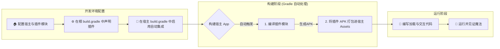

# 快速开始：从零到一运行你的第一个插件

欢迎踏上 `ComboLite` 的探索之旅！本指南将像一位耐心的向导，带你用一杯咖啡的时间，亲手构建并点亮你的第一个动态插件。

我们将引导你完成**宿主配置**、**插件创建**和**插件运行**的全过程，让你在不涉及复杂打包细节的情况下，快速获得“点亮”第一个插件的成就感。准备好了吗？让我们开始吧！

### 前提条件

在开始之前，我们假定您已经根据主 `README` 的指引，在您的 Android 项目中成功引入了 `ComboLite` 的核心库和打包插件。

### 整体流程预览



-----

## 第一步：配置宿主应用 (Host App)

宿主是所有插件的“家”，我们需要为它进行一些基础的初始化和配置。

### 1.1 初始化插件化框架

`ComboLite` 的初始化非常灵活，我们提供两种方式：

#### 方式一：全自动初始化（推荐）

这是最省心的方式。只需让你的 `Application` 类继承自 `BaseHostApplication`，框架便会为你处理底层的初始化流程。你只需通过重写 `onFrameworkSetup` 方法，即可在一个后台协程中完成所有框架的核心配置。

```kotlin
// in :app/src/main/java/your/package/name/MainApplication.kt
import com.combo.core.runtime.PluginManager
import com.combo.core.runtime.ValidationStrategy
import com.combo.core.runtime.app.BaseHostApplication
import com.combo.core.security.crash.PluginCrashHandler

class MainApplication : BaseHostApplication() {
    override fun onCreate() {
        super.onCreate()
        // 你的其他应用级初始化逻辑
    }

    /**
     * 重写此方法，在后台线程中提供自定义的插件框架设置逻辑。
     * super.onCreate() 内部会自动调用 PluginManager.initialize 并执行此代码块。
     */
    override fun onFrameworkSetup(): suspend () -> Unit {
        return {
            // --- 在此进行所有框架相关的配置 ---

            // 示例1: 配置四大组件的代理池
            PluginManager.proxyManager.apply {
                setHostActivity(HostActivity::class.java)
                setServicePool(listOf(HostService1::class.java /*, ... */))
                setHostProviderAuthority("com.your.package.provider")
            }

            // 示例2: 设置插件签名校验策略 (此处设为不校验，仅用于开发)
            PluginManager.setValidationStrategy(ValidationStrategy.Insecure)
            
            // 注意：插件的加载时机应由你的业务逻辑决定，例如在主页或特定时机触发
        }
    }
}
```

#### 方式二：手动初始化（适用于特殊场景）

如果你的 `Application` 由于项目限制无法继承 `BaseHostApplication`，也可以选择手动进行初始化。

```kotlin
// in :app/src/main/java/your/package/name/MainApplication.kt
import android.app.Application
import com.combo.core.runtime.PluginManager
import com.combo.core.runtime.ValidationStrategy
import com.combo.core.security.crash.PluginCrashHandler

class MainApplication : Application() {
    override fun onCreate() {
        super.onCreate()

        // 1. (重要) 注册插件崩溃处理器
        PluginCrashHandler.initialize(this)

        // 2. 初始化插件管理器，并在其后台任务中完成配置
        PluginManager.initialize(this) {
            // 此代码块在后台线程执行
            PluginManager.setValidationStrategy(ValidationStrategy.Insecure)
            // ... 其他配置
        }
    }
}
```

### 1.2 配置宿主 Activity

为了让插件能够正确地访问资源和被代理启动，你的宿主 `Activity` 需要继承自 `BaseHostActivity`。

```kotlin
import com.combo.core.component.activity.BaseHostActivity

class MainActivity : BaseHostActivity() {
    // ...
}
```

> **重要说明**: `BaseHostActivity` 内部重写了 `getResources()` 和 `getAssets()` 方法，以确保插件能无缝访问宿主和自身的资源。同时，它也包含了代理插件 `Activity` 所需的核心逻辑。

-----

## 第二步：创建你的第一个插件

### 2.1 新建插件模块并添加依赖

在您的项目中，新建一个 Android **Library** 模块 (例如，模块名叫 `:my-plugin`)。在新建模块的 `build.gradle.kts` 文件中，添加对 `comboLite-core` 的**编译时依赖**：

```kotlin
// in :my-plugin/build.gradle.kts
dependencies {
    // 插件模块必须使用 compileOnly，因为框架由宿主在运行时提供
    compileOnly(projects.comboLiteCore) 
    // ... 其他依赖
}
```

### 2.2 实现插件入口类 (IPluginEntryClass)

每个插件都需要一个实现了 `IPluginEntryClass` 接口的入口类，它是插件与框架交互的桥梁，包含了插件的生命周期、UI入口和依赖注入配置。

```kotlin
// in :my-plugin/src/main/java/com/example/myplugin/MyPluginEntry.kt
package com.example.myplugin

import androidx.compose.material3.Text
import androidx.compose.runtime.Composable
import com.combo.core.api.IPluginEntryClass
import com.combo.core.model.PluginContext
import org.koin.core.module.Module
import org.koin.dsl.module

class MyPluginEntry : IPluginEntryClass {

    /**
     * 1. (可选) 声明此插件提供的 Koin 依赖注入模块
     * 插件内部的依赖关系可以在这里定义，框架会自动整合与卸载。
     */
    override val pluginModule: List<Module>
        get() = listOf(
            module {
                // 例如: single<MyPluginRepository> { MyPluginRepositoryImpl() }
            }
        )
    
    /**
     * 2. 实现 onLoad 生命周期回调
     * 当插件被框架加载后，此方法会被调用。
     * 这是执行所有初始化逻辑的最佳位置。
     */
    override fun onLoad(context: PluginContext) {
        println("插件 [${context.pluginInfo.id}] 已加载，执行初始化...")
    }

    /**
     * 3. 实现 onUnload 生命周期回调
     * 当插件被框架卸载前，此方法会被调用。
     * 这是执行所有资源清理工作的最佳位置。
     */
    override fun onUnload() {
        println("插件 [com.example.myplugin] 被卸载，执行资源清理...")
    }

    /**
     * 4. 实现 Content 方法，提供插件的 UI 入口
     * 这个方法专门用于定义和返回插件的 Jetpack Compose 界面。
     */
    @Composable
    override fun Content() {
        Text("Hello from My First Plugin!")
    }
}
```

### 2.3 在 Manifest 中配置插件元数据

在插件模块的 `src/main/AndroidManifest.xml` 文件中，通过标准属性和 `<meta-data>` 标签来定义插件的“身份信息”。

| 属性 / 标签                                         | 是否必需   | 含义                             |
|:------------------------------------------------|:-------|:-------------------------------|
| `manifest` 的 `package`                          | **必需** | 定义了插件的唯一 **ID**。               |
| `manifest` 的 `versionCode`/`versionName`        | **必需** | 定义了插件的**版本信息**。                |
| `<meta-data android:name="plugin.entryClass">`  | **必需** | 指定了插件**入口类**的完整路径，框架通过它来实例化插件。 |
| `<meta-data android:name="plugin.description">` | 可选     | 为插件提供一段简短的**描述**文字。            |
| `application` 的 `android:label`                 | 可选     | 插件的**显示名称**，可用于插件管理界面。         |
| `application` 的 `android:icon`                  | 可选     | 插件的**显示图标**，可用于插件管理界面。         |

**配置示例：**

```xml
<manifest xmlns:android="http://schemas.android.com/apk/res/android"
    package="com.example.myplugin"
    android:versionCode="1"
    android:versionName="1.0.0">

    <application 
        android:label="我的第一个插件"
        android:icon="@drawable/plugin_icon">
    
        <meta-data 
            android:name="plugin.entryClass" 
            android:value="com.example.myplugin.MyPluginEntry" />
            
        <meta-data 
            android:name="plugin.description" 
            android:value="This is my first amazing plugin." />
            
    </application>
</manifest>
```

-----

## 第三步：加载并运行插件

### 3.1 准备插件 APK：自动化集成

`ComboLite` 配套的 Gradle 插件 `aar2apk` 提供了强大的自动化能力。以下配置完全参考自项目主 `README.md`。

#### 1. 在项目根 `build.gradle.kts` 中声明插件模块

```kotlin
// in your project's root /build.gradle.kts
plugins {
    // 确保已通过 libs.versions.toml 引入并应用插件
    alias(libs.plugins.combolite.aar2apk)
}

// 在此声明所有插件模块，并可配置统一的打包与签名策略
aar2apk {
    modules {
        module(":my-plugin") // 指向你的插件模块
        // ... 如果有更多插件模块，继续在此添加
    }

    signing {
        // ... 配置您的签名信息
    }
}
```

#### 2. 在宿主 App `build.gradle.kts` 中启用集成

```kotlin
// in your :app/build.gradle.kts
plugins {
    // 确保已通过 libs.versions.toml 引入并应用插件
    alias(libs.plugins.combolite.aar2apk)
}

// ... android { ... }

// 配置插件自动集成功能，用于源码无缝调试
packagePlugins {
    // 启用后，根目录 aar2apk 块中声明的插件将在构建时自动打包进宿主 assets
    enabled.set(true)
    buildType.set(PackageBuildType.DEBUG) // 或 RELEASE
    pluginsDir.set("plugins")             // 插件在 assets 内的存放目录
}

dependencies {
    implementation(libs.combolite.core)
    // ...
}
```

完成以上配置后，每次构建或运行宿主 App，Gradle 都会自动将 `:my-plugin` 等模块编译打包，并置入宿主 APK 的 `assets/plugins/` 目录下。

### 3.2 编写交互代码

为了提供最佳开发体验，示例代码将区分 `DEBUG` 和 `RELEASE` 构建模式。

* **Debug 模式**: App 启动时，自动使用 `installPluginsFromAssetsForDebug` **强制覆盖安装** `assets` 中的插件，确保每次运行的都是最新代码，实现无缝调试。
* **Release 模式**: 模拟真实环境，App 启动后会检查插件是否已安装。如果未安装，则需要用户通过**手动操作**（如下载、从本地文件选择等）来安装插件。

<details>
<summary>👉 点击展开推荐的 `MainActivity.kt` 示例代码</summary>

```kotlin
package com.combo.plugin.sample

import android.os.Bundle
import android.widget.Toast
import androidx.activity.compose.setContent
import androidx.compose.foundation.layout.*
import androidx.compose.material3.Button
import androidx.compose.material3.CircularProgressIndicator
import androidx.compose.material3.Text
import androidx.compose.runtime.*
import androidx.compose.ui.Alignment
import androidx.compose.ui.Modifier
import androidx.compose.ui.unit.dp
import androidx.lifecycle.lifecycleScope
import com.combo.core.api.IPluginEntryClass
import com.combo.core.component.activity.BaseHostActivity
import com.combo.core.runtime.PluginManager
import com.combo.core.utils.installPluginsFromAssetsForDebug
import kotlinx.coroutines.launch
import java.io.File
import java.io.FileOutputStream

class MainActivity : BaseHostActivity() {

    private val pluginId = "com.example.myplugin"
    private var pluginEntry by mutableStateOf<IPluginEntryClass?>(null)
    private var isLoading by mutableStateOf(true)

    override fun onCreate(savedInstanceState: Bundle?) {
        super.onCreate(savedInstanceState)
        
        setContent {
            Box(modifier = Modifier.fillMaxSize(), contentAlignment = Alignment.Center) {
                when {
                    isLoading -> {
                        Column(horizontalAlignment = Alignment.CenterHorizontally) {
                            CircularProgressIndicator()
                            Spacer(Modifier.height(16.dp))
                            Text("正在初始化...")
                        }
                    }
                    pluginEntry != null -> pluginEntry?.Content()
                    else -> ControlScreen()
                }
            }
        }
        
        initialize()
    }

    private fun initialize() {
        lifecycleScope.launch {
            if (BuildConfig.DEBUG) {
                // Debug 模式：每次启动都强制覆盖安装，确保代码最新
                Toast.makeText(this@MainActivity, "Debug模式：强制更新插件", Toast.LENGTH_SHORT).show()
                installPluginsFromAssetsForDebug()
                PluginManager.loadEnabledPlugins()
                PluginManager.launchPlugin(pluginId)
            }
            // 检查插件实例
            pluginEntry = PluginManager.getPluginInstance(pluginId)
            isLoading = false
        }
    }

    @Composable
    private fun ControlScreen() {
        // Release 模式下的交互界面
        Column(
            horizontalAlignment = Alignment.CenterHorizontally,
            verticalArrangement = Arrangement.spacedBy(16.dp)
        ) {
            val isInstalled = PluginManager.isPluginInstalled(pluginId)
            Text(if (isInstalled) "插件已安装但未启动" else "插件未安装")

            if (!isInstalled) {
                Button(onClick = {
                    // Release 模式下，安装逻辑应由您自己实现（如下载）
                    // 此处为快速演示，我们仍然从 assets 安装
                    installManuallyFromAssets()
                }) {
                    Text("手动安装插件")
                }
            } else {
                Button(onClick = {
                    isLoading = true
                    lifecycleScope.launch {
                        PluginManager.loadEnabledPlugins()
                        PluginManager.launchPlugin(pluginId)
                        pluginEntry = PluginManager.getPluginInstance(pluginId)
                        isLoading = false
                    }
                }) {
                    Text("启动插件")
                }
            }
        }
    }
    
    /**
     * 模拟 Release 环境下的手动安装流程。
     * 真实场景中，您应该从网络下载 APK 文件，而不是从 assets 读取。
     */
    private fun installManuallyFromAssets() {
        isLoading = true
        lifecycleScope.launch {
            try {
                // 这是一个模拟实现，实际应替换为您的下载和文件管理逻辑
                val assetPath = "plugins/my-plugin-debug.apk" // 假设的路径
                val pluginFile = File(filesDir, "my-plugin.apk")
                assets.open(assetPath).use { input ->
                    FileOutputStream(pluginFile).use { output ->
                        input.copyTo(output)
                    }
                }
                // 使用 forceOverwrite = false，因为是首次安装
                PluginManager.installerManager.installPlugin(pluginFile, false)
                Toast.makeText(this@MainActivity, "手动安装成功", Toast.LENGTH_SHORT).show()
            } catch (e: Exception) {
                Toast.makeText(this@MainActivity, "手动安装失败: ${e.message}", Toast.LENGTH_LONG).show()
            } finally {
                isLoading = false
            }
        }
    }
}
```

</details>

### 3.3 运行并验证

现在，运行你的宿主 App：

* **在 Debug 模式下**: 你会看到一个短暂的 Toast提示 "Debug模式：强制更新插件"，然后直接显示插件界面 **“Hello from My First Plugin!”**。
* **在 Release 模式下**: 界面会显示 "插件未安装" 和一个按钮。
    1.  点击 **“手动安装插件”** 按钮完成安装。
    2.  之后界面会更新，显示 "插件已安装但未启动" 和 **“启动插件”** 按钮，点击它。
    3.  最终，你会看到插件界面 **“Hello from My First Plugin!”**。

## 恭喜！与后续步骤

太棒了！你已经成功地跨出了最重要的一步，完成了 `ComboLite` 插件化开发的完整闭环。

接下来，我们强烈建议您阅读以下文档，深入探索 `ComboLite` 的更多强大功能：

* **[[核心] 插件打包指南](./2_PACKAGING_GUIDE_ZH.md)**: 深入了解 `aar2apk` 插件，精通两种打包策略。
* **[[进阶] 核心 API 用法](./3_CORE_APIS_ZH.md)**: 掌握 `PluginManager` 的所有核心功能。
* **[[进阶] 四大组件指南](./4_COMPONENTS_GUIDE_ZH.md)**: 学习如何在插件中使用 Activity, Service 等。
* **[[原理] 架构与设计](./5_ARCHITECTURE_ZH.md)**: 探索 ComboLite 的内部工作机制。