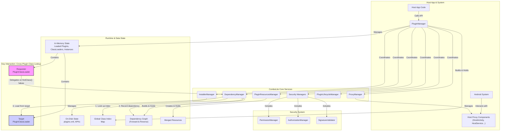

# Architecture & Design Principles (v2.0)

Welcome to the inner workings of `ComboLite`!

This document aims to unveil the internal mechanisms and core design philosophies of `ComboLite` v2.0. By understanding the framework's underlying principles, you will be better able to leverage its features and diagnose issues more efficiently when they arise.

The design philosophy of `ComboLite` v2.0 is rooted in three cornerstones:

* **Ultimate Stability**: Completely abandoning non-public APIs (Hooks & reflection) and using 100% officially recommended mechanisms to ensure the framework's long-term compatibility and reliability.
* **Embracing Modernity**: Natively designed for Jetpack Compose and Kotlin Coroutines, keeping pace with the latest Android development toolchain.
* **Security & Simplicity**: Introducing fine-grained permission control and flexible authorization mechanisms while maintaining the simplicity and clarity of the core logic to reduce the learning and secondary development costs for developers.

-----

### I. High-Level Architecture

`ComboLite` v2.0 adopts a concise and powerful micro-kernel design. An internal context (`PluginFrameworkContext`) holds all the core managers, each with its own responsibilities, which are coordinated and exposed externally by a single commander, `PluginManager`.

#### Internal Component Interaction

* **`PluginManager` (Main Controller)**: The framework's supreme commander and sole singleton entry point. It is responsible for coordinating all other managers and controlling the **runtime state** of all plugins.
* **`InstallerManager` (Installer)**: The administrator of the plugin's "physical world." It handles the installation, update, and uninstallation processes, manages the storage of plugin APKs on disk, and maintains a metadata registry of all installed plugins (`plugins.xml`).
* **`PluginLifecycleManager` (Lifecycle Manager)**: A new manager introduced in v2.0, specifically responsible for core lifecycle operations such as plugin loading, instantiation, launching, unloading, and reloading, resulting in more cohesive logic.
* **`ResourceManager` (Resource Manager)**: The plugin's "visual" engine. It provides a unified `Resources` object by merging the resources of all loaded plugins.
* **`ProxyManager` (Dispatcher)**: The "lifecycle proxy" for the four major components. It manages the proxy components on the host side and correctly dispatches system intents to the corresponding plugin components.
* **`DependencyManager` (Dependency Manager)**: The "relationship graph" between plugins. It dynamically analyzes inter-plugin dependencies during loading, constructing a directed graph that provides data support for "chain restart" and cross-plugin class lookups.
* **`Security System`**: A core upgrade in v2.0. This is a cluster of managers, including:
    * `SignatureValidator`: Responsible for signature validation.
    * `PermissionManager`: Responsible for **static permission checks**.
    * `AuthorizationManager`: Responsible for **dynamic authorization coordination**, serving as the main entry point for permission requests.

-----

### II. Core Workflow: A Plugin's Life Journey

Let's follow a plugin through its complete lifecycle within `ComboLite` v2.0.

#### 1. Installation

When you call `PluginManager.installerManager.installPlugin(apkFile)`:

1.  **Security Check**: `InstallerManager` first validates the plugin based on the `ValidationStrategy` set in `PluginManager`.
    * `Strict`: The signature must be identical to the host's.
    * `UserGrant`: If the signature is different, it requests user authorization via a UI presented by `AuthorizationManager`.
    * `Insecure`: Skips validation (for development use only).
2.  **Metadata Parsing**: It parses the APK's `AndroidManifest.xml` to extract standard attributes like `package` (used as the plugin ID), `versionCode`, and `label` (plugin name).
3.  **Version Comparison**: If a plugin with the same ID already exists, it compares version codes, prohibiting downgrades by default.
4.  **File Persistence & Class Index Generation**:
    * The APK file is copied to the app's private directory, e.g., `/data/data/your.package/files/plugins/com.example.myplugin/base.apk`.
    * It uses the `dexlib2` library to scan this APK, extract all class names, and generate a `class_index` text file within the plugin's directory. This index is key to achieving `O(1)` complexity for cross-plugin class lookups.
5.  **Component Parsing & Information Registration**: It parses static broadcasts and provider information declared in the plugin, and finally writes all metadata into the app's "plugin registry" — the `plugins.xml` file.

#### 2. Loading & Instantiation

When you call `PluginManager.launchPlugin("com.example.myplugin")`, the request is forwarded to `PluginLifecycleManager`:

1.  **Create ClassLoader**: A dedicated `PluginClassLoader` instance is created for the plugin. It holds the path to the plugin and relies on `DependencyManager` for cross-plugin class lookups.
2.  **Load Class Index**: The framework reads all class names from the `class_index` file in the plugin's directory and loads them into a global `ConcurrentHashMap<ClassName, PluginId>` index.
3.  **Load Resources & Register Components**: `ResourceManager` merges the plugin's resources into the host; `ProxyManager` registers the plugin's static broadcasts and providers in memory.
4.  **Save Loading Information**: A `LoadedPluginInfo` object, containing plugin info, the ClassLoader, etc., is created and stored in `PluginManager`'s `loadedPluginsFlow` state.
5.  **Instantiate Entry Class**: `PluginLifecycleManager` uses the `PluginClassLoader` to load and instantiate the plugin's entry class (`IPluginEntryClass`).
6.  **Dependency Injection & Lifecycle Callback**: If the plugin provides Koin modules, the framework automatically loads them. Then, the `onLoad()` method of the entry class instance is called.
7.  **Save Instance**: The plugin instance is stored in the `pluginInstancesFlow` state. At this point, the plugin is fully ready.

#### 3. Unloading

When you call `PluginManager.unloadPlugin("com.example.myplugin")`, `PluginLifecycleManager` executes the above process in reverse:

1.  Calls the `onUnload()` method.
2.  Unloads Koin modules.
3.  Unregisters the four major components from `ProxyManager`.
4.  Removes resources from `ResourceManager`.
5.  Removes all of the plugin's classes from the global class index.
6.  Removes records from `loadedPluginsFlow` and `pluginInstancesFlow`.
7.  Discards the `PluginClassLoader` to be garbage collected.

-----

### III. Implementation Principles of the Four Major Components

The implementation of the four major components is still based on the **Proxy Pattern**. V2.0 has optimized and reinforced this foundation, but the core idea remains the same.

> **Core Flow**:
>
> 1.  **Host-Side Configuration**: Register real proxy components (like `HostActivity`, `HostService`) in the host's `Manifest` and inform `ProxyManager` of their `Class` or `Authority`.
> 2.  **Framework-Level Interception**: When an extension function like `startPluginActivity` is called, the framework creates an `Intent` pointing to the host proxy component and puts the real plugin component's class name as an extra.
> 3.  **Proxy-Side Dispatch**: After the host proxy component (e.g., `HostActivity`) is launched, it retrieves the plugin class name from the `Intent` and uses the plugin's `ClassLoader` to reflectively instantiate an implementation object of an interface like `IPluginActivity`.
> 4.  **Lifecycle Delegation**: The proxy component calls the plugin object's `onAttach(this)` to inject the proxy context, then forwards all subsequent lifecycle events (`onResume`, `onPause`, etc.) one by one to this plugin instance.

* **Activity**: Uses a **Single Placeholder Proxy** model.
* **Service**: Uses a **Proxy Service Pool** model.
* **BroadcastReceiver**: Uses a **Centralized Proxy Dispatch** model.
* **ContentProvider**: Uses a **URI Proxy** model.

-----

### IV. In-depth Analysis of Key Mechanisms

#### 1. Dynamic Dependency Discovery & Class Loading Delegation

This is the core mechanism through which `ComboLite` achieves its "zero-configuration dependency" and "lightning-fast class lookup" features. It is accomplished by the collaboration of three components: the **Global Class Index**, `PluginClassLoader`, and `DependencyManager`.

> **Workflow**: "**Local Lookup -> Delegate to Arbiter -> Index-based Location -> Record Dependency -> Targeted Loading**".
>
> 1.  Plugin A's `PluginClassLoader`, in its `findClass` method, first tries to find the class in its local `dex` file via `super.findClass()`.
> 2.  If it fails and catches a `ClassNotFoundException`, it does **not** immediately throw it. Instead, it "delegates" the lookup task to `DependencyManager`.
> 3.  `DependencyManager`, as an implementation of the `IPluginFinder` interface, queries the **global class index** and discovers that the class belongs to Plugin B.
> 4.  `DependencyManager` dynamically records the `A -> B` dependency relationship in its internal **two dependency graphs**.
> 5.  `DependencyManager` then gets Plugin B's `ClassLoader` and calls its **`findClassLocally`** method. This method directly calls `super.findClass()`, thus loading the required class directly from Plugin B's `dex` file and returning it to Plugin A. `findClassLocally` does **not** delegate again, preventing infinite recursion.
> 6.  Only if `DependencyManager` also fails to find the class will the `PluginClassLoader` throw a special `PluginDependencyException`.

#### 2. Dependency Graph & Chain Restart

**"Chain Restart"** is `ComboLite`'s core safety mechanism for ensuring state consistency after a hot-update. Its implementation relies entirely on the **reverse dependency graph (`dependentGraph`)** dynamically built by `DependencyManager` at runtime.

> **How it works**:
>
> 1.  **Trigger**: When `PluginManager.launchPlugin("plugin-B")` is called on an already loaded plugin B, `PluginLifecycleManager` recognizes it as a "restart" request.
> 2.  **Query Dependents**: `PluginLifecycleManager` immediately calls `dependencyManager.findDependentsRecursive("plugin-B")`.
> 3.  **Graph Traversal**: The `findDependentsRecursive` method performs a **Depth-First Search (DFS)** on the **reverse dependency graph**, starting from the `plugin-B` node, to find all plugins (e.g., `A` and `C`) that directly or indirectly depend on `plugin-B`.
> 4.  **Formulate Restart Plan**: The search result is merged with the trigger point to form a complete restart list, e.g., `[A, C, B]`.
> 5.  **Execute Plan**: `PluginLifecycleManager` will strictly **unload** these plugins in **reverse dependency order** (first `A` and `C`, then `B`), and then **reload** them in **forward order**, ensuring the entire dependency chain is updated consistently.

#### 3. **New: Permission & Authorization Mechanism (v2.0 Core)**

This is the most significant architectural upgrade in v2.0, designed to provide enterprise-grade security for the framework.

1.  **Annotation-based Declaration**: The framework uses the `@RequiresPermission` annotation to declare the required permission level (`HOST` or `SELF`) and failure mode (`hardFail`) for sensitive APIs in core classes like `PluginManager` (e.g., `setPluginEnabled`).
2.  **Caller Tracking**: When a plugin calls these sensitive APIs, the `checkApiCaller` extension function accurately identifies the calling plugin's ID by analyzing the call stack (`Thread.currentThread().stackTrace`) and cross-referencing it with the global class index.
3.  **Static Permission Check**: `AuthorizationManager` first wraps the call information into an `AuthorizationRequest` and passes it to `PermissionManager` for a **static check**. `PermissionManager` makes a quick judgment based on strict rules (e.g., for a `HOST`-level API, does the caller's signature digest match the host's cached digest?).
4.  **Dynamic User Authorization**: If the static check fails and the API is not marked with `hardFail=true`, `AuthorizationManager` forwards the request to an implementation of the `IAuthorizationHandler` interface. By default, `DefaultAuthorizationHandler` launches a built-in `AuthorizationActivity` to display the operation details to the user and request their consent. The host can also replace this default UI by calling `setAuthorizationHandler` to implement a fully custom authorization flow.

This closed-loop process of "**Annotation Declaration -> Static Check -> Dynamic Authorization**" builds a robust and flexible security defense for `ComboLite`.

#### 4. Crash Fusing & Self-Healing

This is `ComboLite`'s "last line of defense," refactored and enhanced in v2.0.

> **How it works**:
>
> 1.  **Signal**: When a `PluginClassLoader` throws a `PluginDependencyException`, this is the key **signal** to trigger the fuse.
> 2.  **Capture & Identify**: `PluginCrashHandler`, as the global exception handler, catches all unhandled exceptions and accurately identifies if they are caused by plugin-related exceptions like `PluginDependencyException`.
> 3.  **Tiered Delegation**: The handler first checks if the crashed plugin has registered its own dedicated `IPluginCrashCallback`. If so, it delegates the handling to it. If not, it checks if the host has registered a **global callback**.
> 4.  **Default Fusing**: If no callback handles the exception, `PluginCrashHandler` executes the default fusing logic: it launches a user-friendly `CrashActivity` that guides the user to **disable the offending plugin and restart the app**. This achieves self-healing and prevents the app from getting stuck in an infinite crash loop.

-----

### V. Key Design Decisions

* **Why 0 Hooks?**

  > For **ultimate stability and future compatibility**. Android is increasingly restricting non-public APIs, and any solution based on Hooks faces a huge risk of failing on new system versions. `ComboLite` chose a "harder" but more correct path, relying entirely on official public APIs and the proxy pattern. While this involves trade-offs in some extreme scenarios (like complex `launchMode`), it provides rock-solid long-term reliability in return.

* **Why is a Class Index Needed?**

  > For **lightning-fast cross-plugin class lookup performance**. Traditional plugin frameworks often need to traverse a linked list of multiple `ClassLoader`s to find a class across plugins, which is an `O(n)` operation. By pre-scanning all classes with `dexlib2` during installation and building a global `HashMap` index, `ComboLite` reduces the time complexity of class lookups to `O(1)`, ensuring smooth application performance.

* **Why "Chain Restart"?**

  > For **state consistency after hot-updates**. In complex dependency relationships, updating a low-level core plugin without restarting the upstream plugins that depend on it can easily lead to crashes like `NoSuchMethodError` due to the mix of old and new code. The `Chain Restart` mechanism uses `DependencyManager` to automatically identify all affected plugins and updates them as a whole in an "atomic operation," fundamentally eliminating state inconsistency issues.

* **Why Introduce the v2.0 Security System?**

  > For **enterprise-grade robustness and openness**. The implicit trust model of v1.0 was too fragile to support an open plugin ecosystem. The v2.0 security system makes building an open "plugin marketplace" possible: the host can confidently allow users to install plugins from unknown sources because all high-risk operations are firmly controlled by the permission system. The final decision always rests with the user, achieving a perfect balance between security and flexibility.

* **Why Merged Resources, Not Isolated?**

  > For a **superior developer experience**. Implementing strict resource isolation is extremely complex and, in most scenarios, unnecessary. `ComboLite`'s merged resource management allows developers to "forget" the origin of resources and use them transparently from any plugin, just like in a monolithic app. This greatly simplifies plugin development and UI collaboration. Of course, this also requires developers to follow good resource naming conventions to avoid conflicts.