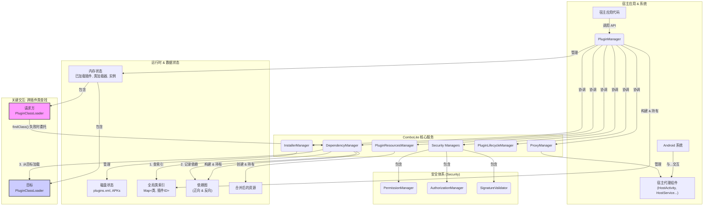

# 架构与设计原理 (v2.0)

欢迎深入 `ComboLite` 的内核！

本篇文档旨在揭示 `ComboLite` v2.0 的内部工作机制和核心设计理念。通过理解框架的底层原理，你将能更好地利用其特性，并在遇到问题时进行更高效的诊断。

`ComboLite` v2.0 的设计哲学根植于三大基石：

* **极致稳定 (Stability)**：彻底抛弃非公开 API (Hook & 反射)，100% 使用官方推荐的机制，确保框架的长期兼容性和可靠性。
* **拥抱现代 (Modernity)**：原生为 Jetpack Compose 和 Kotlin Coroutines 设计，与最新的 Android 开发工具链保持同步。
* **安全透明 (Security & Simplicity)**：引入了精细化的权限管控和灵活的授权机制，同时保持核心逻辑的简洁与清晰，降低开发者的理解和二次开发成本。

-----

### 一、宏观架构 (High-Level Architecture)

`ComboLite` v2.0 采用简洁而强大的微核设计，由一个内部上下文 (`PluginFrameworkContext`) 持有所有各司其职的核心管理器，由最高指挥官 `PluginManager` 统一对外协调。

#### 内部组件交互

* **`PluginManager` (总控制器)**: 框架的最高指挥官和唯一的单例入口。它负责协调其他所有管理器，并掌管所有插件的 **运行时状态**。
* **`InstallerManager` (安装器)**: 插件的“物理世界”管理员。负责插件的安装、更新、卸载流程，管理插件 APK 在磁盘上的存储，并维护所有已安装插件的元数据清单 (`plugins.xml`)。
* **`PluginLifecycleManager` (生命周期管理器)**: v2.0 中新增的管理者，专门负责插件的加载、实例化、启动、卸载和重载等核心生命周期操作，逻辑更内聚。
* **`ResourceManager` (资源管理器)**: 插件的“视觉”引擎。通过合并所有已加载插件的资源，提供一个统一的 `Resources` 对象。
* **`ProxyManager` (调度器)**: 四大组件的“生命周期代理人”。负责管理宿主端的代理组件，并将系统意图（Intent）正确地分发给对应的插件组件。
* **`DependencyManager` (依赖管理器)**: 插件间的“关系图谱”。在插件加载时动态分析插件间的依赖关系，构建出一个有向图，为“链式重启”和跨插件类查找提供数据支持。
* **`Security System` (安全体系)**: v2.0 的核心升级。这是一个管理器集群，包含了：
    * `SignatureValidator`: 负责签名校验。
    * `PermissionManager`: 负责**静态权限检查**。
    * `AuthorizationManager`: 负责**动态授权协调**，是权限请求的总入口。

-----

### 二、核心工作流：一个插件的生命之旅

让我们跟随一个插件，走完它在 `ComboLite` v2.0 中的完整生命周期。

#### 1. 安装 (Installation)

当你调用 `PluginManager.installerManager.installPlugin(apkFile)` 时：

1.  **安全检查**: `InstallerManager` 首先会根据 `PluginManager` 中设置的 `ValidationStrategy` (签名校验策略) 来校验插件。
    * `Strict`: 必须与宿主签名一致。
    * `UserGrant`: 如果签名不一致，则通过 `AuthorizationManager` 弹出 UI 请求用户授权。
    * `Insecure`: 跳过校验（仅限开发时使用）。
2.  **元数据解析**: 解析 APK 的 `AndroidManifest.xml`，提取出 `package` (作为插件ID)、`versionCode`、`label` (插件名) 等标准属性。
3.  **版本对比**: 如果同 ID 的插件已存在，它会比较版本号，默认禁止降级覆盖。
4.  **文件持久化与类索引生成**:
    * 将 APK 文件复制到应用私有目录，如 `/data/data/your.package/files/plugins/com.example.myplugin/base.apk`。
    * 使用 `dexlib2` 库扫描这个 APK，提取出其中所有的类名，并生成一个 `class_index` 文本文件，存放在插件目录中。这个索引是实现 `O(1)` 复杂度跨插件类查找的关键。
5.  **组件解析与信息注册**: 解析插件中声明的静态广播、Provider 信息，最后将所有元数据写入应用的“插件户口本”——`plugins.xml` 文件中。

#### 2. 加载与实例化 (Loading & Instantiation)

当你调用 `PluginManager.launchPlugin("com.example.myplugin")` 时，请求会被转发给 `PluginLifecycleManager`：

1.  **创建类加载器**: 为该插件专属的 `PluginClassLoader` 实例被创建。它持有插件的路径，并依赖 `DependencyManager` 进行跨插件类查找。
2.  **加载类索引**: 框架从插件目录下的 `class_index` 文件中读取所有类名，并加载到一个全局的 `ConcurrentHashMap<ClassName, PluginId>` 索引中。
3.  **加载资源与注册组件**: `ResourceManager` 将插件资源合并到宿主中；`ProxyManager` 将插件的静态广播和 Provider 注册到内存。
4.  **保存加载信息**: 一个包含插件信息、ClassLoader 等数据的 `LoadedPluginInfo` 对象被创建，并存入 `PluginManager` 的 `loadedPluginsFlow` 状态中。
5.  **实例化入口类**: `PluginLifecycleManager` 使用 `PluginClassLoader` 来加载并实例化插件的入口类 (`IPluginEntryClass`)。
6.  **依赖注入与生命周期回调**: 如果插件提供了 Koin 模块，框架会自动加载它们。随后，调用入口类实例的 `onLoad()` 方法。
7.  **保存实例**: 插件实例被存入 `pluginInstancesFlow` 状态中，此时插件已完全就绪。

#### 3. 卸载 (Unloading)

当你调用 `PluginManager.unloadPlugin("com.example.myplugin")` 时，`PluginLifecycleManager` 会逆序执行上述过程：

1.  调用 `onUnload()` 方法。
2.  卸载 Koin 模块。
3.  从 `ProxyManager` 中注销四大组件。
4.  从 `ResourceManager` 中移除资源。
5.  从全局类索引中移除该插件的所有类。
6.  从 `loadedPluginsFlow` 和 `pluginInstancesFlow` 中移除记录。
7.  废弃 `PluginClassLoader` 等待 GC。

-----

### 三、四大组件实现原理

四大组件的实现原理依然基于**代理模式**，v2.0 在此基础上进行了优化和加固，但核心思想不变。

> **核心流程**：
>
> 1.  **宿主端配置**：在宿主 `Manifest` 中注册真实的代理组件（如 `HostActivity`, `HostService`），并将其 `Class` 或 `Authority` 告知 `ProxyManager`。
> 2.  **框架层拦截**：当调用 `startPluginActivity` 等扩展函数时，框架会创建一个指向宿主代理组件的 `Intent`，并将真正的插件组件类名作为 extra 数据放进去。
> 3.  **代理端分发**：宿主代理组件（如 `HostActivity`）启动后，从 `Intent` 中取出插件类名，通过插件的 `ClassLoader` 反射实例化 `IPluginActivity` 等接口的实现对象。
> 4.  **生命周期托管**：代理组件调用插件对象的 `onAttach(this)` 注入代理上下文，然后将后续所有生命周期事件（`onResume`, `onPause` 等）一一转发给这个插件实例。

* **Activity**: 采用**单一占坑代理**模型。
* **Service**: 采用**代理服务池**模型。
* **BroadcastReceiver**: 采用**中心化代理分发**模型。
* **ContentProvider**: 采用**URI 代理**模型。

-----

### 四、关键机制深度解析

#### 1. 动态依赖发现与类加载委托

这是 `ComboLite` 实现“无配置依赖”和“闪电般类查找”两大特性的核心机制。它由三个组件协同完成：**全局类索引**、**`PluginClassLoader`** 和 **`DependencyManager`**。

> **工作流程**：“**本地查找 -> 委托仲裁 -> 索引定位 -> 记录依赖 -> 定向加载**”。
>
> 1.  插件 A 的 `PluginClassLoader` 在 `findClass` 方法中，首先尝试通过 `super.findClass()` 在本地 `dex` 中查找类。
> 2.  如果查找失败并捕获 `ClassNotFoundException`，它**不会**立即抛出，而是将查找任务“委托”给 `DependencyManager`。
> 3.  `DependencyManager` 作为 `IPluginFinder` 接口的实现，会查询**全局类索引**，发现这个类属于插件 B。
> 4.  `DependencyManager` 动态地在内部的**两个依赖图**中，记录下 `A -> B` 的依赖关系。
> 5.  `DependencyManager` 随后获取插件 B 的 `ClassLoader`，并调用其 **`findClassLocally`** 方法。这个方法直接调用 `super.findClass()`，从而直接从插件 B 的 `dex` 文件中加载所需的类，然后返回给插件 A。`findClassLocally` **不会再次委托**，从而避免了无限递归。
> 6.  如果 `DependencyManager` 也找不到，`PluginClassLoader` 才会抛出一个特殊的 `PluginDependencyException`。

#### 2. 依赖图谱与链式重启

**“链式重启”** 是 `ComboLite` 保证热更新后状态一致性的核心安全机制。它的实现完全依赖于 `DependencyManager` 在运行时动态构建的**反向依赖图 (`dependentGraph`)**。

> **工作原理**:
>
> 1.  **触发**: 当对一个已加载的插件 B 调用 `PluginManager.launchPlugin("plugin-B")` 时，`PluginLifecycleManager` 识别出这是一个“重启”请求。
> 2.  **查询依赖方**: `PluginLifecycleManager` 会立即调用 `dependencyManager.findDependentsRecursive("plugin-B")`。
> 3.  **图遍历**: `findDependentsRecursive` 方法会在**反向依赖图**上，从 `plugin-B` 节点开始进行一次**深度优先搜索 (DFS)**，找出所有直接或间接依赖于 `plugin-B` 的插件（例如 `A` 和 `C`）。
> 4.  **制定重启计划**: 搜索结果与触发点合并，形成完整的重启列表 `[A, C, B]`。
> 5.  **执行计划**: `PluginLifecycleManager` 会严格按照**依赖关系的逆序**（先 `A` 和 `C`，最后 `B`）依次**卸载**这些插件，然后再按**正序**依次**重新加载**它们，确保整个依赖链上的所有插件都被更新。

#### 3. **全新：权限与授权机制 (v2.0 核心)**

这是 v2.0 最重大的架构升级，旨在为框架提供企业级的安全性。

1.  **注解式声明**: 框架通过 `@RequiresPermission` 注解，为 `PluginManager` 等核心类中的敏感 API（如 `setPluginEnabled`）声明了所需的权限等级 (`HOST` 或 `SELF`) 和失败模式 (`hardFail`)。
2.  **调用者追踪**: 当插件调用这些敏感 API 时，扩展函数 `checkApiCaller` 会通过分析调用堆栈 (`Thread.currentThread().stackTrace`)，并对照全局类索引，精准地识别出发起调用的插件 ID。
3.  **静态权限检查**: `AuthorizationManager` 首先将调用信息封装成 `AuthorizationRequest`，交给 `PermissionManager` 进行**静态检查**。`PermissionManager` 会基于严格的规则（如：调用 `HOST` 级别 API 的插件，其签名摘要是否与宿主缓存的摘要一致）快速做出判断。
4.  **动态用户授权**: 如果静态检查失败，且 API 没有被标记为 `hardFail=true`，`AuthorizationManager` 会将请求流转给 `IAuthorizationHandler` 接口的实现。默认情况下，`DefaultAuthorizationHandler` 会启动一个内置的 `AuthorizationActivity`，向用户展示本次操作的详细信息，并请求用户授权。宿主也可以通过 `setAuthorizationHandler` 替换掉这个默认 UI，实现完全自定义的授权流程。

这套“**注解声明 -> 静态检查 -> 动态授权**”的闭环流程，为 `ComboLite` 构筑了一道坚实而灵活的安全防线。

#### 4. 崩溃熔断与自愈

这是 `ComboLite` 的“最后一道防线”，在 v2.0 中得到了重构和增强。

> **工作原理**：
>
> 1.  **信号**: 当 `PluginClassLoader` 抛出 `PluginDependencyException` 时，这是触发熔断的关键**信号**。
> 2.  **捕获与识别**: `PluginCrashHandler` 作为全局异常处理器，会捕获所有未处理的异常，并精准识别出是否由 `PluginDependencyException` 等插件相关异常引起。
> 3.  **分级委托**: 处理器会优先检查崩溃插件自身是否注册了专属的 `IPluginCrashCallback`。如果有，则交由其处理。如果没有，则检查宿主是否注册了**全局回调**。
> 4.  **默认熔断**: 如果所有回调都未处理该异常，`PluginCrashHandler` 将执行默认的熔断逻辑：启动一个友好的 `CrashActivity`，引导用户选择**禁用肇事插件并重启应用**，从而实现应用的自愈，避免陷入无限崩溃的循环。

-----

### 五、关键设计抉择

* **为什么是 0 Hook？**

  > 为了**极致的稳定和未来的兼容性**。Android 系统对非公开 API 的限制日益收紧，任何基于 Hook 的方案都面临着在新系统版本上失效的巨大风险。`ComboLite` 选择了一条更“艰难”但更正确的道路，完全依赖官方公开的 API 和代理模式，虽然在某些极端场景（如复杂的 `launchMode`）上有所取舍，但换来的是坚如磐石的长期可靠性。

* **为什么需要类索引？**

  > 为了**闪电般的跨插件类查找性能**。传统的插件化框架在跨插件寻找类时，往往需要遍历一个由多个 `ClassLoader` 组成的链表，这是一个 `O(n)` 的操作。`ComboLite` 在插件安装时，通过 `dexlib2` 预先扫描所有类并建立一个全局 `HashMap` 索引，将类查找操作的时间复杂度降至 `O(1)`，保证了应用的流畅运行。

* **为什么有“链式重启”？**

  > 为了**热更新后的状态一致性**。在复杂的依赖关系中，更新一个底层的核心插件而不重启依赖它的上游插件，极易导致 `NoSuchMethodError` 等各种因新旧代码混用而引发的崩溃。`链式重启` 机制通过 `DependencyManager` 自动分析出所有受影响的插件，并以“原子操作”的方式将它们作为一个整体进行更新，从根本上杜绝了状态不一致的问题。

* **为什么引入 v2.0 的安全体系？**

  > 为了**企业级的健壮性和开放性**。v1.0 的隐式信任模型过于脆弱，无法支撑一个开放的插件生态。v2.0 的安全体系，使得构建一个开放的“插件市场”成为可能：宿主可以大胆地允许用户安装未知来源的插件，因为所有高风险操作都被权限系统牢牢掌控，最终决定权始终在用户手中，实现了安全与灵活的完美平衡。

* **为什么资源是合并式而非隔离式？**

  > 为了**卓越的开发者体验**。资源的严格隔离实现起来极其复杂，且在绝大多数场景下并非必要。`ComboLite` 采用的合并式资源管理，让开发者可以“忘记”资源的出处，像开发单体应用一样透明地使用任何插件的资源。这极大地简化了插件的开发和 UI 协作。当然，这也要求开发者有良好的资源命名规范，以避免命名冲突。